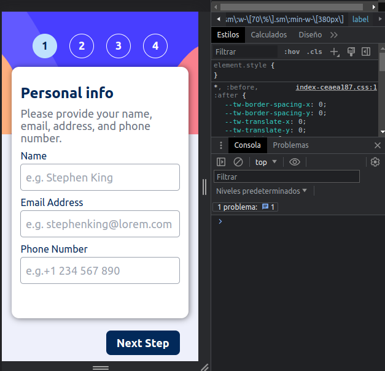
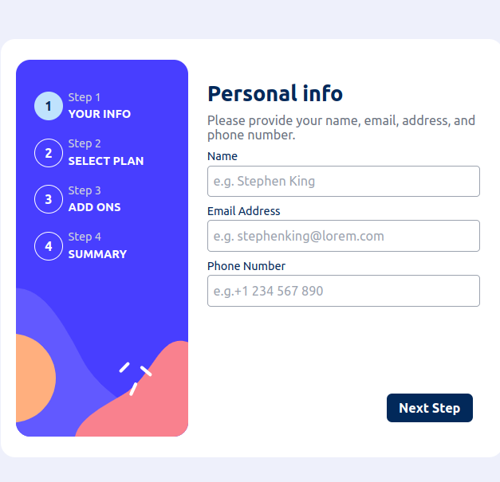

# Frontend Mentor - Multi-step form solution

This is a solution to the [Multi-step form challenge on Frontend Mentor](https://www.frontendmentor.io/challenges/multistep-form-YVAnSdqQBJ). Frontend Mentor challenges help you improve your coding skills by building realistic projects. 

## Table of contents

- [Overview](#overview)
  - [The challenge](#the-challenge)
  - [Screenshot](#screenshot)
  - [Links](#links)
- [My process](#my-process)
  - [Built with](#built-with)
  - [What I learned](#what-i-learned)
  - [Continued development](#continued-development)
  - [Useful resources](#useful-resources)
- [Author](#author)
- [Acknowledgments](#acknowledgments)


## Overview
-functional multi-step form with responsive design

### The challenge

Users should be able to:

- Complete each step of the sequence
- Go back to a previous step to update their selections
- See a summary of their selections on the final step and confirm their order
- View the optimal layout for the interface depending on their device's screen size
- See hover and focus states for all interactive elements on the page
- Receive form validation messages if:
  - A field has been missed
  - The email address is not formatted correctly
  - A step is submitted, but no selection has been made
-The challenge is to create the necessary logic to handle the data entered in a form
### Screenshot





### Links

- Solution URL: [Add solution URL here](https://github.com/anonimussapee/multistep/tree/main/src)
- Live Site URL: [Add live site URL here](https://mstep.netlify.app/)

## My process

-My favorite process is to identify which are the breakpoints and analyze how the html should be structured in order to continue with the structure it will have, it doesn't matter if at first you are not using dynamic data, the important thing for me is to know how it should look and then do the logic with Js dynamically

### Built with

- Semantic HTML5 markup
- CSS custom properties
- Flexbox
- Mobile-first workflow
- [React](https://reactjs.org/) - JS library
- TailWindCss

### What I learned

I put the knowledge to the test and what I learned is that you have to determine enough time to develop it correctly

```js
    const [error, setError] = useState({
    step1:false,
    step2:false,
    step3:false,

  })

  const [opChoose, setOpChoose] = useState({
    step1:{
      name:'',
      email:'',
      number:''
    },
    step2:{
      op1:true,
      op2:false,
      op3:false,
      opDesc:{
        op1:{state:true,imgClass:'arcade',name:'Arcade', price:{mm:9,yy:90}},
        op2:{state:false,imgClass:'advanced',name:'Advanced', price:{mm:12,yy:120}},
        op3:{state:false,imgClass:'pro',name:'Pro', price:{mm:15,yy:150}},
      },  
      planBill: {mm:true,yy:false}
    },
    step3:{
      op1:false,
      op2:false,
      op3:false,
      opDesc:{
        op1:{state:false,name:'Online service',more:'Access to multiplayer games', price:{mm:1,yy:10}},
        op2:{state:false,name:'Larger Storaged',more:'Extra 1TB of cloud save', price:{mm:2,yy:20}},
        op3:{state:false,name:'Customizable profile',more:'Custom theme on your profile', price:{mm:2,yy:20}},
      }, 
    },
    step4:{
      confirm:false
    }
  })

  const emailChecking = (email) => {
    const emailPattern = /^[a-zA-Z0-9._-]+@[a-zA-Z0-9._-]+\.[a-zA-Z]{2,4}$/
    return emailPattern.test(email)
  }

  const stepNeed = () => {

    let stepChecking = {name:false, email:false,number:false}
    if((opChoose.step1.name).length > 0){
      stepChecking.name = true
    } 
    const emailCheck = emailChecking(opChoose.step1.email)
    if(emailCheck === true){
      stepChecking.email = true
    }
    if((opChoose.step1.number).length > 5){
      stepChecking.number = true 
    }

    return stepChecking
  }

  // in here is use the stepNeed function to  save data of form required 
  const stepNeedData =  stepNeed()


  const [step, setStep] = useState({
    step1:true,
    step2:false,
    step3:false,
    step4:false,
  })
   

  // this code save index of step position
  const inStep = formSteps[(Object.keys(step))[((Object.values(step)).findIndex(item => item===true))]]
  const inStepNumber = (Object.values(step)).findIndex(item => item===true)
 
  // functions to changestep 
  const onNextButton = () => {
    const stepsInArray = Object.entries(step)
    
    // in here i verify if actual step is equal to totals step
    if((inStepNumber+1 < stepsInArray.length) && stepNeedData.email && stepNeedData.name && stepNeedData.number){
      setError({...error})
      stepsInArray[inStepNumber][1] = false
      stepsInArray[inStepNumber+1][1] = true 
      setStep(Object.fromEntries (stepsInArray))
    }else if(!stepNeedData.email && !stepNeedData.name && !stepNeedData.number){

      setError({ step1:true, step2:true, step3:true})

    }else if(stepNeedData.email && !stepNeedData.name && !stepNeedData.number){

      setError({ step1:true, step2:false, step3:true})

    }else if(!stepNeedData.email && stepNeedData.name && !stepNeedData.number){

      setError({ step1:false, step2:true, step3:true})

    }else if(!stepNeedData.email && !stepNeedData.name && stepNeedData.number){

      setError({ step1:true, step2:true, step3:false})

    }else if(stepNeedData.email && stepNeedData.name && !stepNeedData.number){

      setError({ step1:false, step2:false, step3:true})

    }else if(!stepNeedData.email && !stepNeedData.name && stepNeedData.number){

      setError({ step1:true, step2:false, step3:false})

    }else if(!stepNeedData.email && stepNeedData.name && stepNeedData.number){

      setError({ step1:false, step2:true, step3:false})

    }
  }
```

### Continued development

as something important to continue improving the handling of state in objects with several sublevels


## Author

- Website - [John Cordova](https://jdx.netlify.app/)
- Frontend Mentor - [@yourusername](https://www.frontendmentor.io/profile/anonimussapee)


## Acknowledgments

I want to thank the academy and [André Proaño](https://thenowintelligence.com/)  for teaching me technology
